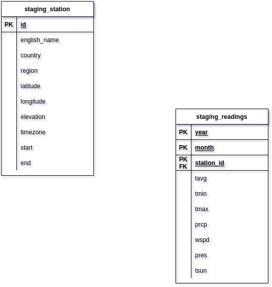

<h2>Udacity Data Engineer Nanodegree - Capstone Project</h2>

---

<h3>Project Summary</h3>

In this project, I design and build a data pipeline that provides historical weather measurement data for all available weather stations as provided by  Meteostat endpoints. This project provides a data warehouse that will serve as a sing-source-of-truth for potential data analysts and to allow dashboards to integrate location-based weather data.

Documentation Structure:

<ul>
<li>Scope project and source data</li>
<li>Tools and architecture</li>
<li>Data Dictionary</li>
<li>Data Model</li>
<li>Setup Steps</li>
<li>Run Application</li>
<li>Future Design Considerations</li>
</ul>

---

<h3>Scope project and source data</h3>

This project will integrate weather station properties and weather measurement.

Data Sets:

<ul>
<li><a href="https://dev.meteostat.net/bulk/stations.html">Weather Station Data</a></li>
<li><a href="https://dev.meteostat.net/bulk/monthly.html">Monthly Measurements</a></li>
</ul>

---

<h3>Tools and Architecture</h3>
<ul>
<li>Meteostat API</li>
<li>AWS S3</li>
<li>AWS Redshift</li>
<li>AWS EMR</li>
<li>Apache Airflow</li>
<li>PySpark</li>
<li>Python</li>
</ul>

---

<h3>Data Dictionary</h3>

<strong>Monthly Data Measurements</strong>

<strong>Weather Station Properties</strong>

---

<h3>Data Model</h3>>

The data warehouse was designed as a Star schema with only one dimension, the weather station properties. However,
other dimensions can be derived by aggregating data from the fact table (staging_readings)

---

<h3>Setup Steps:</h3>

<ol>
    <li>Set Environment Variables  
    For your <strong>config.ini</strong> file (template test_config.ini file with project): 
        <ul>
            <li>S3_RAW_STATION_INPUT = s3://_your_s3_bucket_/raw_station_data</li>
            <li>S3_CLEAN_STATION_OUTPUT = s3://_your_s3_bucket_/clean_station_data</li>
            <li>S3_RAW_READINGS_INPUT = s3://_your_s3_bucket_/raw_readings_data</li>
            <li>S3_CLEAN_READINGS_OUTPUT = s3://_your_s3_bucket_/clean_readings_data</li>
            <li>BUCKET = _your_s3_bucket_</li>
            <li>PREFIX = raw_readings_data</li>
            <li>N/B: Create each subfolder in your S3 bucket (raw_station_data, clean_station_data, raw_readings_data, clean_readings_data)</li>
        </ul>
    </li> 
    <li>Airflow Variables
        <ul>
            <li>access_key_id : _your_aws_access_key_id</li>
            <li>secret_access_key  : _your_aws_secret_key</li>
            <li>emr_id : _your_EMR_CLUSTER_ID</li>
            <li>raw_station_data_key : raw_station_data</li>
            <li>clean_readings_data_key : clean_readings_data</li>
            <li>clean_station_data_key : clean_station_data</li>
            <li>my_s3_bucket : _your_s3_bucket</li>
        </ul>
    </li> 
    <li>Create a AWS Redshift cluster and EMR cluster with Apache Spark and Hadoop installed.</li> 
    <li>Copy ALL Spark-related files <strong>(util.py, transform_data.py, spark_app.py, read_data.py, and download_readings_by_station_id.py)</strong> to the home directory of EMR Master node using this command:  -> <strong>scp -i ~/_path_to_/_your_key_pair.pem util.py, transform_data.py, spark_app.py, read_data.py, and download_readings_by_station_id.py hadoop@ec2-X-XX-XX-XXX.compute-1.amazonaws.com:~/.</strong></li>     
    <li>Remotely log into EMR cluster to confirm files are copied successfully using this command:  -> <strong>ssh -i ~/_path_to/your_key_pair.pem hadoop@ec2-X-XX-XX-XXX.compute-1.amazonaws.com</strong></li> 
    <li>While remotely logged into EMR Master node, run this command: -> <strong>pip install boto3 requests</strong></li>
</ol>

---

<h3>Run Application</h3>

To Run the application, start Airflow webserver and scheduler. Then run the DAG.

---

<h3>Future Design Considerations</h3>

Since the weather measurements are continuous, an additional feature would include adding daily/monthly queries to the Meteostat API to update
data warehouse.

---

<h3>Write Up</h3>
<ol>
    <li>
    The data was increased by 100x.
    

        In a scenario where the data increases by 100x, my AWS EMR configuration is set to Auto Scaling if required. This would take care of any requirement
        for additional computation.
    

    </li>
    <li>
    The pipelines would be run on a daily basis by 7 am every day.
    

        This scenario, as I stated in "Future Design Considerations", would be handled by using Airflow to schedule the job to run at 7 am every day.
    

    </li>
    <li>
    The database needed to be accessed by 100+ people.
    

        AWS Redshift is capable of handling up to 500 connections as a result, I am confident this scenario will be handled appropriately. 
    

    </li>
</ol>

<h4>Choice of Tools, Technologies, and Data Model</h4>
<ul>
    <li>Star Schema
        

            The dataware serves as a store of historical data for weather measurements from different weather stations. It was first populated with ALL
            historical datasets for all weather stations and will receive batch uploads monthly. Hence, a star schema is more optimized for infrequent writes and reads. A star schema is also optimized for aggregation queries.
        

    </li>
    <li>Meeostat API
        

            I chose this API because the dataset available are the most up to date and they are very frequently updated.
        

    </li>
    <li>AWS S3
        

            I chose to use S3 bucket as it provides a relatively cheap storage solution. It also integrates seamlessly with other tools I employed in this project. 
        

    </li>
    <li>AWS Redshift
        

            Choosing Redshift was only natural since it provides an optimized data warehouse that fits seamlessly with all the other technologies I used. Also, it provides bandwith for scaling the project. 
        

    </li>
    <li>AWS EMR
        

            I chose to use an EMR cluster to reduce configuration complexities of Spark on local environment and provide flexibility for scaling computation needs as necessary.
        

    </li>
    <li>Apache Airflow
        

            I decided to use Airflow to help schedule/coordinate wait time between each task, especially the task that come immediately after EMR job. It would have been very difficult to figure out when the next task should complete after transform in EMR without Airflow.
        

    </li>
    <li>PySpark
        

            Since I was going to be transforming more than 1 million records, I decided to use a more powerful compute engine such as Airflow so as not to be limited by my computer's memory.
        

    </li>
    <li>Python
        

            Python programming language provides the largest data engineering integrations with many tools. 
        

    </li>
</ul>
