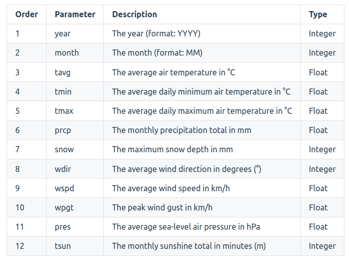
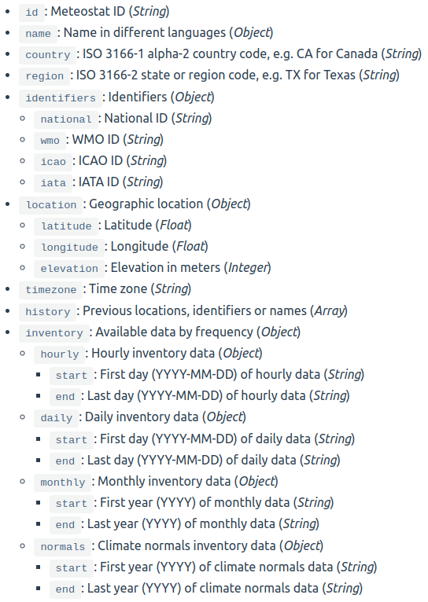

<h2>Udacity Data Engineer Nanodegree - Capstone Project</h2>

---

<h3>Project Summary</h3>

In this project, I design and build a data pipeline that provides historical weather measurement data for all available weather stations as provided by  Meteostat endpoints. This project provides a data warehouse that will serve as a sing-source-of-truth for potential data analysts and to allow dashboards to integrate location-based weather data.

Documentation Structure:

<ul>
<li>Scope project and source data</li>
<li>Tools and architecture</li>
<li>Data Dictionary</li>
<li>Setup Steps</li>
</ul>

---

<h3>Scope project and source data</h3>

This project will integrate weather station properties and weather measurement.

Data Sets:

<ul>
<li><a href="https://dev.meteostat.net/bulk/stations.html">Weather Station Data</a></li>
<li><a href="https://dev.meteostat.net/bulk/monthly.html">Monthly Measurements</a></li>
</ul>

---

<h3>Tools and Architecture</h3>
<ul>
<li>Meteostat API</li>
<li>AWS S3</li>
<li>AWS Redshift</li>
<li>AWS EMR</li>
<li>Apache Airflow</li>
<li>PySpark</li>
<li>Python</li>
</ul>

---

<h3>Data Dictionary</h3>

<strong>Monthly Data Measurements</strong>

<strong>Weather Station Properties</strong>

---

<h3>Setup Steps:</h3>

<ol>
    <li>Set Environment Variables  
    For your <strong>config.ini</strong> file (template test_config.ini file with project):
        <ul>
            <li>S3_RAW_STATION_INPUT = s3://{your_s3_bucket}/raw_station_data</li>
            <li>S3_CLEAN_STATION_OUTPUT = s3://{your_s3_bucket}>/clean_station_data</li>
            <li>S3_RAW_READINGS_INPUT = s3://{your_s3_bucket}/raw_readings_data</li>
            <li>S3_CLEAN_READINGS_OUTPUT = s3://{your_s3_bucket}/clean_readings_data</li>
            <li>BUCKET = {your_s3_bucket}</li>
            <li>PREFIX = raw_readings_data</li>
            <li>N/B: Create each subfolder in your S3 bucket (raw_station_data, clean_station_data, raw_readings_data, clean_readings_data)</li>
        </ul>
    </li>
    <li></li>
    <li></li>
    <li></li>
    <li></li>
</ol>
