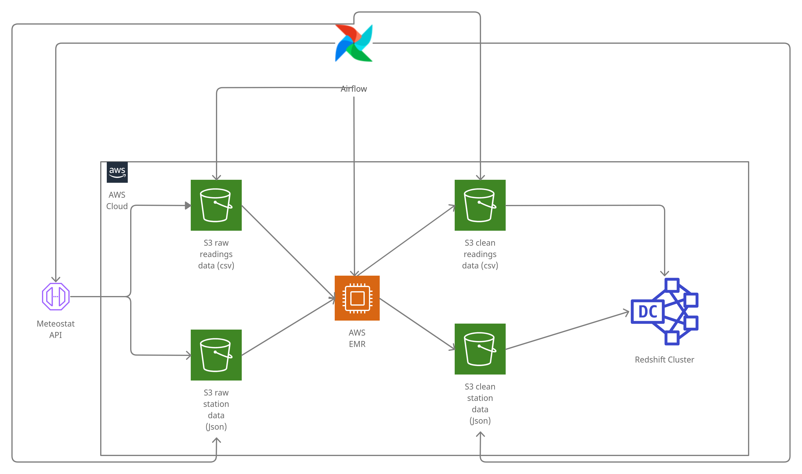

<h2>Udacity Data Engineer Nanodegree - Capstone Project</h2>

---

<h3>Project Summary</h3>

In this project, I design and build a data pipeline that provides historical weather measurement data for all available weather stations as provided by  Meteostat endpoints. This project provides a data warehouse that will serve as a sing-source-of-truth for potential data analysts.

Documentation Structure:

<ul>
<li>Scope project and source data</li>
<li>Tools and architecture</li>
<li>Data Dictionary</li>
<li>Define the data model</li>
<li>Setup Steps</li>
</ul>

---

<h3>Scope project and source data</h3>

This project will integrate weather station data and weather measurement data with fact and dimension tables.

Data Sets:

<ul>
<li><a href="https://dev.meteostat.net/bulk/stations.html">Weather Station Data</a></li>
<li><a href="https://dev.meteostat.net/bulk/monthly.html">Monthly Measurements</a></li>
</ul>

---

<h3>Tools and Architecture</h3>
<ul>
<li>Meteostat API</li>
<li>AWS S3</li>
<li>AWS Redshift</li>
<li>AWS EMR</li>
<li>Apache Airflow</li>
<li>PySpark</li>
<li>Python</li>
</ul>

---

<h3>Data Dictionary</h3>

<strong>Monthly Data Measurements</strong>

<strong>Weather Station Properties</strong>

